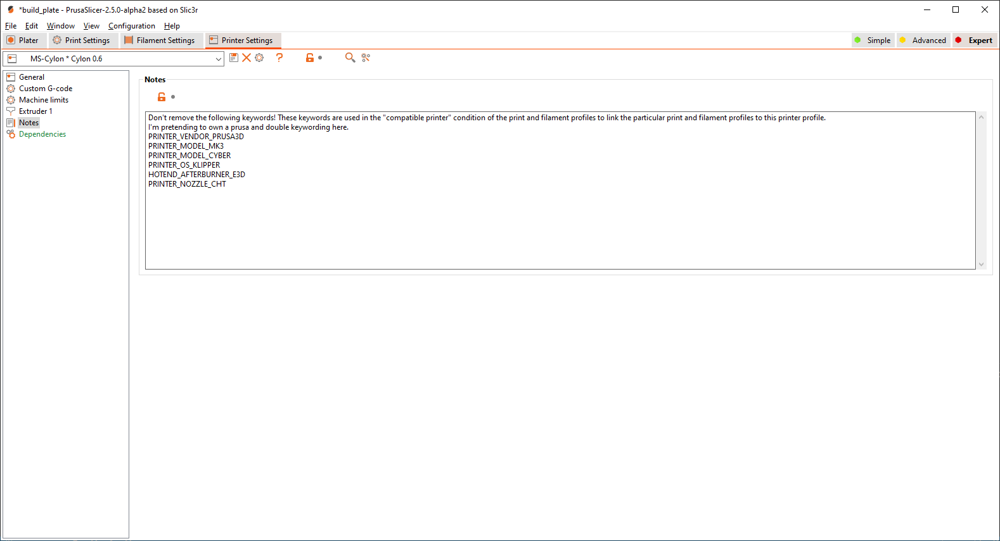
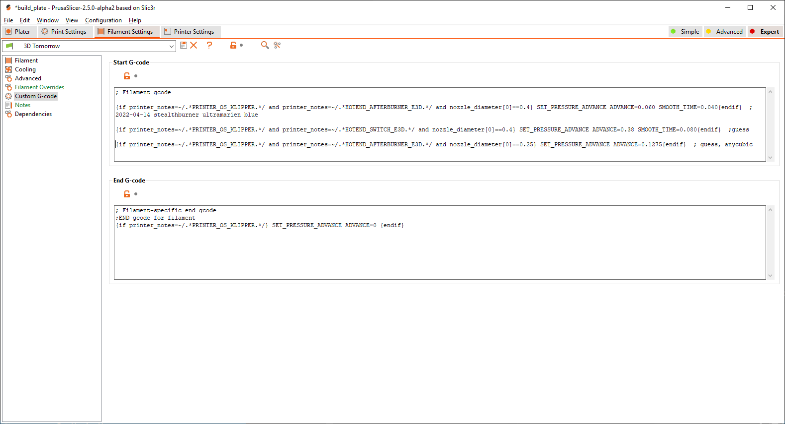

PrusaSlicer (and SuperSlicer) have the ability to inject custom gcode from the settings pages. That's great if you use klipper as you can set `PRESSURE_ADVANCE` from the slicer, for each filament.

Even better there's some templating language available so you can query which hotend setup and nozzle size you have. This isn't always perfect as I'm needing to use different filament profiles for highflow hotends/CHT nozzles but it does reduce the amount of tinkering to get a print to work as I usually have a filament profile set up for every brand and type of filament or maybe every spool with a custom flow multipler set, as they're all slightly different, ABS is very different from PLA.

First in `printer settings -> notes` we set some tags to identify the printer type. On my switchwire I have

```jinja
PRINTER_VENDOR_PRUSA3D
PRINTER_MODEL_MK3
PRINTER_MODEL_E3DD
PRINTER_OS_KLIPPER
HOTEND_AFTERBURNER_E3D
HOTEND_AFTERBURNER_REVO
```

I've left the prusa tags in because my printer runs of modified MK3 profiles, and the stock MK3 profiles work great, they're just very slow on a printer that can do very quick accelerations.

`PRINTER_OS_KLIPPER` is there for me to test whether i should output marlin gcode or klipper extended gcode

`HOTEND_AFTERBURNER_E3D` is there for me to test for what kind of hotend I have, I also have `HOTEND_SWITCH_E3D` for a multi extruder bowden setup like a prusa MMU1 [(obligotary UberNero)](https://www.youtube.com/watch?v=X6C9ptTeeyw) and `HOTEND_AFTERBURNER_CHT` for my copperhead/cht highflow setup. I'm not actually doing anything different with `HOTEND_AFTERBURNER_REVO` yet, it seems to be performing like an E3D V6 everywhere i would need to tune it, including the max vol flow, but I've only tested that with PLA.

In `filament settings -> custom gcode` the fun really begins. In the start gcode I might have something like this that


```jinja
{if printer_notes=~/.*PRINTER_OS_KLIPPER.*/ and printer_notes=~/.*HOTEND_AFTERBURNER_E3D.*/ and nozzle_diameter[0]==0.4} SET_PRESSURE_ADVANCE ADVANCE=0.060 SMOOTH_TIME=0.040{endif}  ; 2022-04-14 stealthburner ultramarine blue

{if printer_notes=~/.*PRINTER_OS_KLIPPER.*/ and printer_notes=~/.*HOTEND_SWITCH_E3D.*/ and nozzle_diameter[0]==0.4} SET_PRESSURE_ADVANCE ADVANCE=0.38 SMOOTH_TIME=0.080 {endif}  ;guess

{if printer_notes=~/.*PRINTER_OS_KLIPPER.*/ and printer_notes=~/.*HOTEND_AFTERBURNER_E3D.*/ and nozzle_diameter[0]==0.25} SET_PRESSURE_ADVANCE ADVANCE=0.1275 SMOOTH_TIME=0.040 {endif}  ; guess, from anycubic
```

and in the filament end gcode I just get rid of pressure advance, mostly because it makes MMU behaviour less violent, although I should probably just turn pressure advance off in the MMU filament change scripts.

```jinja
{if printer_notes=~/.*PRINTER_OS_KLIPPER.*/} SET_PRESSURE_ADVANCE ADVANCE=0 {endif}
```

## Further reading
* [PrusaSlicer Macro language](https://help.prusa3d.com/article/macros_1775)
* [PrusaSlicer available variables](https://help.prusa3d.com/article/list-of-placeholders_205643)



